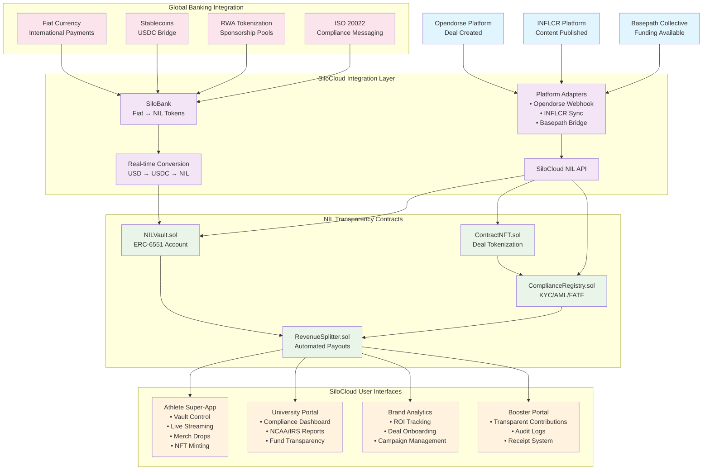

# SiloCloud NIL Transparency Network - System Flow Diagram

## Complete Flow: Opendorse Deal → NILVault → SiloCloud → Compliance Dashboard → Payout

This diagram shows how SiloCloud makes the NIL Transparency Network **real and usable** by providing the interface layer between users and the blockchain infrastructure.



## Detailed Step-by-Step Flow

### 1. **Deal Initiation (Opendorse → SiloCloud)**
```
Brand creates deal on Opendorse
→ Opendorse webhook triggers
→ SiloCloud Opendorse Adapter processes
→ Deal converted to NIL format
→ Terms uploaded to IPFS
```

### 2. **Smart Contract Integration (SiloCloud → Blockchain)**
```
SiloCloud API calls NILVault.createNILDeal()
→ ContractNFT minted with deal terms
→ ComplianceRegistry.checkDealCompliance()
→ Deal stored on-chain with audit trail
```

### 3. **User Interface Updates (Blockchain → SiloCloud)**
```
Smart contract events emitted
→ SiloCloud listens for events
→ Athlete Super-App shows new deal
→ University Portal updates compliance view
→ Brand Analytics tracks deal creation
```

### 4. **Compliance Processing (Automated)**
```
ComplianceRegistry runs automated checks:
→ KYC/AML verification
→ NCAA eligibility confirmation
→ Deal value limits validation
→ Auto-approval or manual review queue
```

### 5. **Deal Execution (Multi-party)**
```
Athlete completes deliverables
→ Brand approves completion
→ SiloCloud triggers NILVault.executeNILDeal()
→ RevenueSplitter.distributeFunds()
→ Payments sent to all parties
```

### 6. **Banking Integration (Fiat Conversion)**
```
International sponsor payment in EUR
→ SiloBank processes conversion
→ EUR → USDC → NIL tokens
→ ISO 20022 message generated
→ Tokens deposited to athlete vault
```

### 7. **Real-time Updates (All Interfaces)**
```
Payment execution complete
→ Athlete app shows updated balance
→ University portal logs transaction
→ Brand analytics updates ROI
→ Booster portal shows contribution flow
```

## SiloCloud Value Proposition

### **For Athletes (Super-App Experience)**
- **Vault Control**: See NIL token balance, pending deals, fiat equivalent
- **Engagement Monetization**: Stream, sell merch, mint NFTs, receive tips
- **Reputation Score**: Portable Proof-of-Success and Proof-of-Loyalty
- **Compliance Made Simple**: Automatic tax documents and audit trails

### **For Universities (Compliance Dashboard)**
- **One Pane of Glass**: All athlete activity visible instantly
- **Automated Reporting**: NCAA/IRS/ISO 20022 reports generated automatically
- **Funding Transparency**: Track every dollar from boosters to athletes
- **80% Less Manual Work**: Eliminate paper trails and spreadsheet management

### **For Brands (Analytics & ROI)**
- **Seamless Integration**: Existing Opendorse/INFLCR workflows unchanged
- **Real ROI Tracking**: Engagement, deliverables, and conversion metrics
- **Transparent Payments**: See exactly what spend produced what results
- **Global Reach**: Accept payments in any currency, any country

### **For Boosters/Donors (Trust & Transparency)**
- **No Black Box**: Every dollar tied to specific NIL vault or deal
- **Tokenized Contributions**: Receipts and audit logs for all donations
- **Direct Impact**: See how contributions support specific athletes
- **Tax Compliance**: Automatic 1099 generation and reporting

### **For Global Finance (Banking Rails)**
- **Universal Access**: Fiat → stablecoin → NIL token conversion
- **RWA Tokenization**: Sponsorship pools and future earnings as tradeable assets
- **Regulatory Compliance**: Full ISO 20022 international payment standard
- **Multi-currency Support**: Accept payments from any country

## Technical Architecture Benefits

### **Existing Platform Integration**
```typescript
// Opendorse deals flow directly into NIL network
opendorseAdapter.handleDealCreated(webhookPayload);
// INFLCR content automatically earns NIL tokens
inflcrAdapter.syncContentAndCalculateRewards(athleteId);
// Basepath collective funds distribute transparently
basepathAdapter.processCollectiveDistribution(fundingEvent);
```

### **Universal Banking Rails**
```typescript
// Any currency, any country, any payment method
siloBankNIL.convertFiatToNIL(5000, 'EUR', athleteVault, bankAccount);
// Automatic compliance and conversion
siloBankNIL.processInternationalPayment(globalPaymentData);
// RWA tokenization for institutional investors
siloBankNIL.createRWAPool(sponsorshipPoolData);
```

### **Real-time Compliance**
```typescript
// Automated NCAA/IRS/ISO 20022 compliance
complianceRegistry.generateAutomatedReport('comprehensive');
// Instant audit trails for any transaction
transactionHistory.getComplianceAudit(vaultAddress);
// Real-time regulatory alert system
alertSystem.monitorComplianceViolations(universityId);
```

## Why SiloCloud Makes NIL Transparency **Real**

Without SiloCloud, the NIL Transparency Network is just smart contracts on a blockchain. With SiloCloud:

1. **Athletes get a CashApp + Twitch + Shopify experience** that happens to be backed by transparent smart contracts
2. **Universities get instant compliance visibility** instead of weeks of paperwork
3. **Brands get ROI analytics they can actually use** with seamless platform integration  
4. **Boosters get legitimate, traceable contribution channels** instead of gray-market risk
5. **Global money flows in and out** through proper banking channels with full regulatory compliance

**SiloCloud is the bridge that makes blockchain transparency feel like modern fintech.**