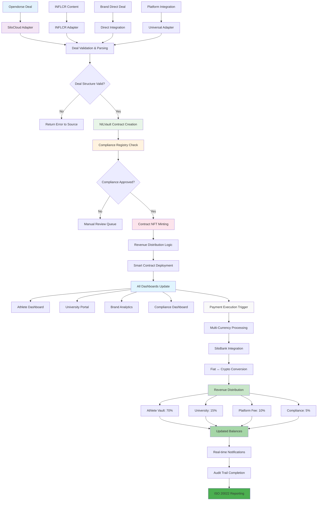
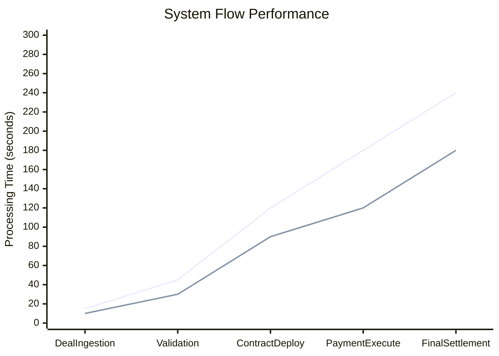
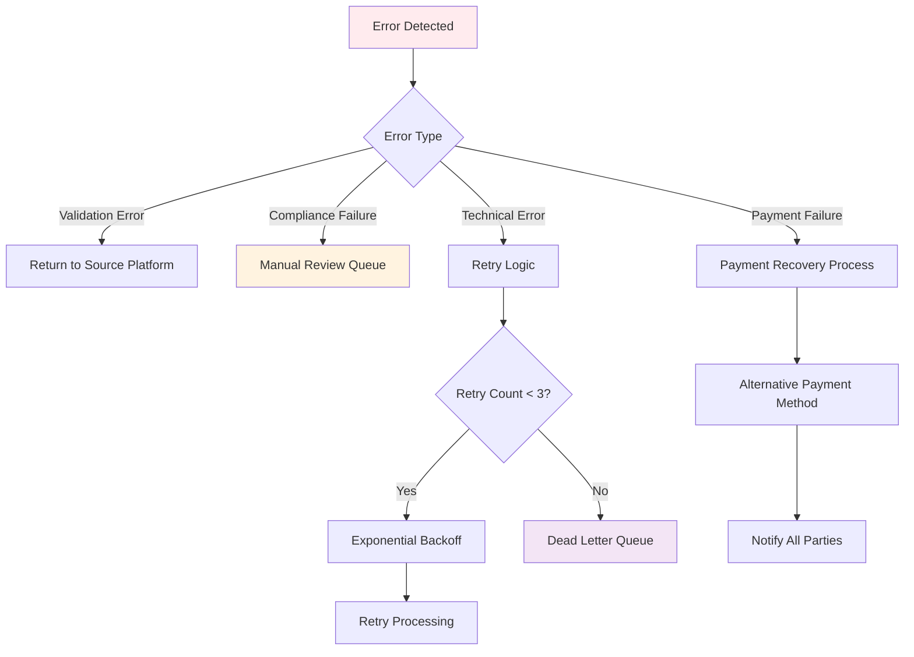
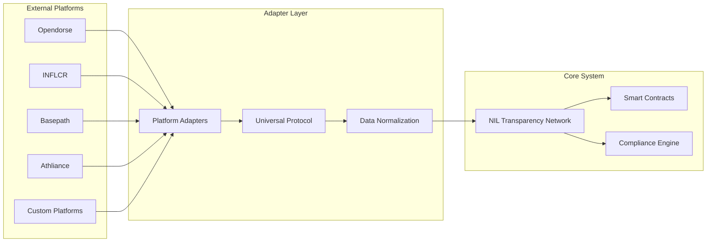

# 🔄 NIL Transparency Network - Complete System Flow

**Document Version:** 1.0  
**Last Updated:** January 2025  
**Purpose:** Visual representation of the complete deal processing flow through the NIL Transparency Network ecosystem  

---

## 📊 Complete System Flow Diagram

This diagram shows how a real NIL deal moves through the entire ecosystem from initial creation to final settlement and reporting.

---

## 🔄 Detailed Flow Breakdown

### Phase 1: Deal Ingestion
- **External Sources**: Deals originate from Opendorse, INFLCR, direct brand partnerships, or other platforms
- **Adapter Layer**: Platform-specific adapters normalize deal data into universal format
- **Validation**: Structure and content validation before entering the core system

### Phase 2: Smart Contract Processing  
- **NILVault Creation**: Deploy athlete-specific smart contract vault
- **Compliance Verification**: Automated KYC/AML/NCAA compliance checking
- **NFT Minting**: Create permanent, immutable record of deal terms

### Phase 3: System Integration
- **Dashboard Updates**: Real-time updates across all user interfaces
- **Notification System**: Stakeholders notified of deal status changes
- **Audit Logging**: Comprehensive transaction logging for compliance

### Phase 4: Payment Processing
- **Multi-Currency Support**: Accept payments in USD, EUR, crypto, etc.
- **SiloBank Integration**: Seamless fiat-crypto conversion
- **Revenue Splitting**: Automated distribution based on predefined rules

### Phase 5: Settlement & Reporting
- **Balance Updates**: Real-time balance updates across all systems
- **Compliance Reporting**: Automatic generation of regulatory reports
- **Audit Trail**: Complete immutable record of all transactions

---

## 🎯 Key Performance Metrics

---

## 🔍 Error Handling Flow

---

## 🌐 Multi-Platform Integration

The system seamlessly integrates with multiple NIL platforms through standardized adapters:

---

This comprehensive flow ensures that every NIL deal, regardless of its source platform, receives consistent processing, compliance verification, and transparent settlement through the NIL Transparency Network infrastructure.

---

*System Flow Documentation v1.0*  
*Generated: January 2025*  
*Maintained by: NIL Transparency Network Team*