# 📊 NIL Transparency Network - System Graphs & Visualizations

**Generated:** September 7, 2025  
**Purpose:** Visual Analytics and Performance Dashboards  
**Tools:** Mermaid, Chart.js, D3.js, Grafana

---

## 📈 Financial Performance Graphs

### Revenue Growth Projection (5-Year)


### Market Share Growth


### User Growth Metrics


---

## 🏗️ System Architecture Flow

### Transaction Processing Flow


### Data Flow Architecture


---

## 💻 System Performance Metrics

### Response Time Distribution


### Infrastructure Utilization


### Database Performance Trends


---

## 🔒 Security & Compliance Metrics

### Security Incident Tracking


### Compliance Success Rates


### Smart Contract Security Metrics


---

## 📊 Business Intelligence Dashboards

### NIL Market Analytics


### Geographic Distribution


### Platform Integration Status

```mermaid
flowchart LR
    subgraph "Platform Integrations"
        A[Opendorse] --> A1[✅ Active]
        B[INFLCR] --> B1[✅ Active]
        C[Basepath] --> C1[🔄 In Progress]
        D[Athliance] --> D1[📅 Planned]
        E[TeamSnap] --> E1[📅 Planned]
        F[Hudl] --> F1[📅 Future]
    end

    subgraph "Integration Metrics"
        A1 --> G[15,000 deals/month]
        B1 --> H[8,500 deals/month]
        C1 --> I[Expected: 5,000 deals/month]
        D1 --> J[Expected: 3,000 deals/month]
    end

    style A1 fill:#c8e6c9
    style B1 fill:#c8e6c9
    style C1 fill:#fff3e0
    style D1 fill:#e3f2fd
    style E1 fill:#e3f2fd
    style F1 fill:#fafafa
```



---

## 🎯 Performance Benchmarking

### Competitive Analysis - Transaction Speed


### Cost Comparison Analysis


### System Reliability Metrics


---

## 🌐 Network Effects Visualization

### User Network Growth


### Value Creation Network


---

## 📈 Investment & Valuation Graphs

### Enterprise Value Growth


### ROI Analysis by Partnership Stake

```mermaid
pie title Partnership Value Distribution ($645M Total)
    "SiloCloud (40%)" : 258
    "Niotavonne (30%)" : 194
    "Unykorn (30%)" : 193
```

### Revenue Stream Evolution

```mermaid
xychart-beta
    title "Revenue Stream Mix Evolution"
    x-axis [Year1, Year2, Year3, Year4, Year5]
    y-axis "Revenue Mix (%)" 0 --> 100
    line "Transaction Fees" [65, 65, 65, 65, 65]
    line "SaaS Licensing" [25, 25, 25, 25, 25]
    line "Domain Registry" [5, 5, 5, 5, 5]
    line "DeFi Services" [5, 5, 5, 5, 5]
```

---

## 🎛️ Real-Time Operations Dashboard

### System Health Overview

```mermaid
flowchart TD
    subgraph "Health Status"
        A[API Gateway: ✅ Healthy]
        B[Database: ✅ Healthy]
        C[Blockchain: ✅ Healthy]
        D[Cache Layer: ✅ Healthy]
        E[External APIs: ⚠️ Degraded]
    end

    subgraph "Performance Metrics"
        F[Response Time: 245ms avg]
        G[Throughput: 15K RPS]
        H[Error Rate: 0.12%]
        I[Uptime: 99.97%]
    end

    subgraph "Business Metrics"
        J[Daily Active Users: 25K]
        K[Deals Processed: 1.2K]
        L[Revenue Today: $85K]
        M[Compliance Rate: 99.2%]
    end

    style A fill:#c8e6c9
    style B fill:#c8e6c9
    style C fill:#c8e6c9
    style D fill:#c8e6c9
    style E fill:#fff3e0
```

### Alert Status Board

```mermaid
flowchart LR
    subgraph "Critical Alerts"
        A[0 Active]
    end

    subgraph "Warning Alerts"
        B[3 Active]
        B1[High Memory Usage - App Server 3]
        B2[Slow Query - Analytics DB]
        B3[Rate Limit Approaching - Polygon API]
    end

    subgraph "Info Alerts"
        C[12 Active]
        C1[Scheduled Maintenance - 2AM UTC]
        C2[New Feature Deployment - Completed]
        C3[Performance Optimization - In Progress]
    end

    style A fill:#c8e6c9
    style B fill:#fff3e0
    style C fill:#e3f2fd
```

---

## 📊 Advanced Analytics Visualizations

### Machine Learning Model Performance

```mermaid
xychart-beta
    title "Compliance Prediction Model Accuracy"
    x-axis [Week1, Week2, Week3, Week4, Week5, Week6]
    y-axis "Accuracy %" 80 --> 100
    line "Model Accuracy" [87, 89, 92, 94, 96, 97]
    line "Precision" [85, 88, 91, 93, 95, 96]
    line "Recall" [89, 90, 93, 95, 97, 98]
    line "F1 Score" [87, 89, 92, 94, 96, 97]
```

### User Behavior Funnel

```mermaid
flowchart TD
    A[100% - Users Visit Platform]
    --> B[75% - Create Account]
    --> C[60% - Complete Profile]
    --> D[45% - Submit First Deal]
    --> E[35% - Deal Approved]
    --> F[28% - Receive Payment]
    --> G[22% - Become Regular User]
    --> H[15% - Refer Other Users]

    style A fill:#e3f2fd
    style B fill:#e8f5e8
    style C fill:#fff3e0
    style D fill:#fce4ec
    style E fill:#f3e5f5
    style F fill:#e8f5e8
    style G fill:#c8e6c9
    style H fill:#a5d6a7
```

### Technology Stack Performance

```mermaid
xychart-beta
    title "Technology Stack Response Times (ms)"
    x-axis ["CDN", "Load Balancer", "API Gateway", "Application", "Database", "Blockchain"]
    y-axis "Response Time (ms)" 0 --> 300
    bar [15, 25, 45, 120, 85, 250]
```

---

## 🎨 Interactive Dashboard Components

### Real-Time Transaction Monitor

```html
<!-- Example React Component Structure -->
<div className="transaction-monitor">
  <div className="metric-card">
    <h3>Transactions/Second</h3>
    <div className="metric-value">245</div>
    <div className="metric-trend positive">+12%</div>
  </div>

  <div className="metric-card">
    <h3>Average Deal Value</h3>
    <div className="metric-value">$2,450</div>
    <div className="metric-trend positive">+8%</div>
  </div>

  <div className="metric-card">
    <h3>Success Rate</h3>
    <div className="metric-value">99.2%</div>
    <div className="metric-trend stable">0%</div>
  </div>
</div>

<style>
  .transaction-monitor {
    display: grid;
    grid-template-columns: repeat(3, 1fr);
    gap: 1rem;
    margin-bottom: 2rem;
  }

  .metric-card {
    background: white;
    padding: 1.5rem;
    border-radius: 8px;
    box-shadow: 0 2px 4px rgba(0, 0, 0, 0.1);
    text-align: center;
  }

  .metric-value {
    font-size: 2rem;
    font-weight: 700;
    color: #667eea;
    margin: 0.5rem 0;
  }

  .metric-trend {
    font-size: 0.9rem;
    font-weight: 600;
  }

  .metric-trend.positive {
    color: #4caf50;
  }
  .metric-trend.negative {
    color: #f44336;
  }
  .metric-trend.stable {
    color: #9e9e9e;
  }
</style>
```

### Geographic Heat Map Data

```javascript
// Example data structure for geographic visualization
const geographicData = {
  regions: [
    { region: 'Southeast', deals: 2250, value: '$45.2M', growth: '+35%' },
    { region: 'Midwest', deals: 1850, value: '$38.7M', growth: '+28%' },
    { region: 'West', deals: 1420, value: '$31.5M', growth: '+42%' },
    { region: 'Southwest', deals: 1180, value: '$26.8M', growth: '+31%' },
    { region: 'East', deals: 950, value: '$22.1M', growth: '+25%' },
    { region: 'Other', deals: 380, value: '$8.9M', growth: '+18%' },
  ],
  states: [
    { state: 'TX', deals: 485, value: '$9.8M' },
    { state: 'CA', deals: 442, value: '$9.2M' },
    { state: 'FL', deals: 398, value: '$8.1M' },
    { state: 'AL', deals: 365, value: '$7.6M' },
    { state: 'GA', deals: 334, value: '$6.9M' },
  ],
};
```

---

This comprehensive visualization suite provides stakeholders with real-time insights into system performance, business metrics, user behavior, and financial projections through interactive dashboards and detailed analytical charts.

---

_Visualization Suite Version 1.0_  
_Generated: September 7, 2025_  
_Tools: Mermaid, D3.js, Chart.js, Grafana_  
_Update Frequency: Real-time for operational metrics_
